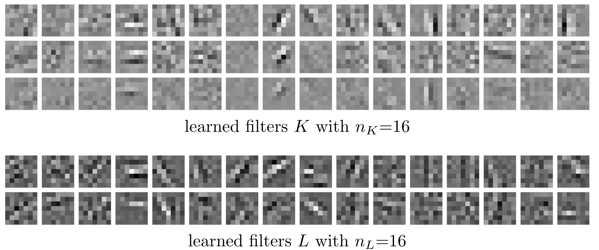

# Learned Discretization Schemes for the Second-Order Total Generalized Variation

This repository contains the basic implementation for learned discretization schemes for the second-order total generalized variation (TGV). A piggyback algorithm is used to solve the bilevel problem to learn enhanced interpolation filters. An example of such learned filters is shown below. 




If this is useful to you, please cite

```
@inproceedings{bogensperger2023learned,
  title={Learned Discretization Schemes for the Second-Order Total Generalized Variation},
  author={Bogensperger, Lea and Chambolle, Antonin and Effland, Alexander and Pock, Thomas},
  booktitle={International Conference on Scale Space and Variational Methods in Computer Vision},
  pages={484--497},
  year={2023},
  organization={Springer}
}
```

## Dependencies

* pytorch 
* matplotlib
* numpy 
* cv2

## Running the Code

TGV-regularized minimization can be run with the command below. Check the possible input arguments in the file to control whether no filters (reference TGV) is used, or a filter setting where the number of locations in the pixel grid to interpolate can be controlled using the parameters $n_K$ and $n_L$. You can also load the learned filters to test them. 

~~~
python tgv_min.py
~~~

Learning the filter weights $K$ and $L$ can be done using the piggyback algorithm implemented in the following file. Each time after approximate saddle-points and adjoint saddle-points have been computed, the parameters can be updated using a gradient-based optimization scheme (implemented here is Adam). 

~~~
python learn.py
~~~